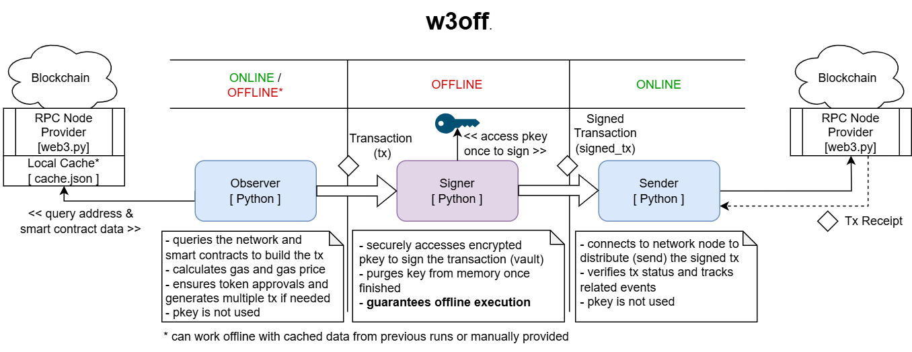

**`w3off`** (**W**eb3 **Off**line) is a collection of CLI utilities for offline wallet management. The intended use case is creation and signing of transactions offline.

Currently supports only `EVM` networks. Default configurations are specified for the following networks, but you can easily add more in `chains.yaml`:
* Ethereum (MainNet)
* Ethereum Sepolia (TestNet)
* Base 
* Arbitrum
* Binance (BnB) SmartChain
* Optimism (OP MainNet)
* Avalanche

**This is not a wallet!** The intention is for you to manage your own keys. `w3off` just provides utilities for you to be able to explore the blockchain and create (presumably, complex) transactions using your offline (cold) keys, stored elsewhere and never used while you are online. 

# Motivation
The project is spurred by the fact that vast majority of typical web3 wallets are *hot wallets* in a form of browser extension or mobile app. By design, any hot wallet would have to store the private key in memory and on disk (e.g. for cross-session state keeping and uninterrupted experience between the user sessions). Albeit encrypted, coupled with the fact that hot wallet is always online while browsing and using your device, it exposes you to additional attack vectors. 

In general, hot wallets are often focused on improving Web3 browsing experience, so although security is critical some reasonable compromises are being made.

If your goal is **low** number of transactions with **increased security** for larger amount of funds, having an offline wallet and the transactions constructed offline is a preference.

# Alternative solutions
**1. Hardware wallets**
Although highly recommended, hardware wallets can also be exposed to additional attack vectors, such as a *supply-chain attacks*. For example, you may be located in the region where sourcing directly from producer is not possible. Additional layer of software employed by hardware wallets also slightly increases the attack surface. Ultimately, you do not control the hardware of the wallet, and you have to trust the manufacturer and the supply chain. 

**2. Offline wallet alternatives**
There are some web3 wallets which provide support for offline transactions (e.g. using *software wallets*), such as:

*2.1) MEW* - Great for simple fund movements (ETH or ERC20 tokens), but if you want to construct a more complex transaction, such as staking your USDT for additional yield, or other smart contract interactions, this functionality is not supported. However, MEW's *"send offline" helper* is helpful and you can use it to broadcast signed transactions created with help of `w3off` utilities (specifically, `observer` and `signer`).\
*2.2) MyCrypto* - Unfortunately, this project is no longer supported and ceased to work.\
*2.3) AirGap* - The flow requires a mobile device.\
*2.4) Cast* (part of *Foundy*) - provides a lot of CLI utilities, but the primary use case is testing web3 applications.

How is `w3off` different?
- Guarantees offline signing
- CLI interphase
- Open-source
- Supports any EVM chains
- Supports any Smart Contract transactions (think lending, pooling, staking, exchanging your tokens and redeeming them for additional yield)
- Developed with security in mind

# High-Level Architecture

The solution consists of three modules, intended to be run one after the other:
1. `Observer`: Helps conveniently build the transaction (no key used)
2. `Signer`: Signs the transaction offline using your securely stored cold and encrypted keystore
3. `Sender`: Sends the signed (raw) transaction(s) (no key used)

 Signer -> Sender"/>

# Configuration
You can configure the tool for your own use by following this sequence:
1) Configure chains and RPC providers in [`w3off/chains.yaml`](w3off/chains.yaml).
2) [Optional] Configure default values or preferences in [`w3off/config.py`](w3off/config.py).
3) The application aims to cache web requests to `w3off/cache.json` persistently (mostly, contract ABIs or bytecodes). Since this data rarely chages on the network, the cache is never invalidated by the utilities. Clean the cache manually as needed by removing this file, e.g. if you suspect smart contract info in it may be outdated.

If you are installing the `w3off` package with `pip`, you can put your settings to `~/.w3off` folder, i.e. `~/.w3off/chains.yaml`. In this case, this folder will be used for both settings and cache instead.

# Usage
Execute the following in CLI and it will launch the tool in interactive mode. It will always prompt you before proceeding to next step so don't worry.
Prerequisite: `pip install` or `conda install` if needed.

At this point, there is no support for CLI parameters (only interactive mode).

Ensure tests pass before using on your side:
```
$ python -m unittest discover
```

Simple launch:
```
$ python -m w3off
```

Or launch one by one:
```
$ python -m observer
$ python -m signer
$ python -m sender
```

You can also do this:
```
# sign and send using transcation JSON from file
$ python -m signer < yourTx.json
$ python -m sender < rawTx.json
```

Or this:
```
# send raw transaction passed as a string
$ echo "0x..." | python -m sender  
```


Alternatively, you can install the executable scripts via `pip`:
```
$ pip install w3off
$ w3off
$ w3observer
$ w3signer
$ w3sender
```

<!-- Deprecated:
```
$ w3off dataFromCall transfer(address,uint256) 0x5AD1F1Aa106B5Af3A4F9D8B095427Df95607a452 2002220000
``` -->